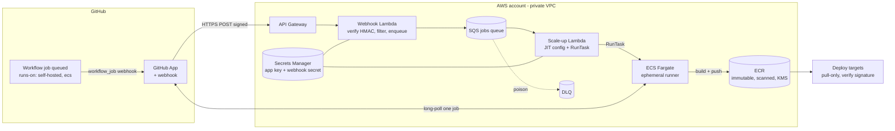
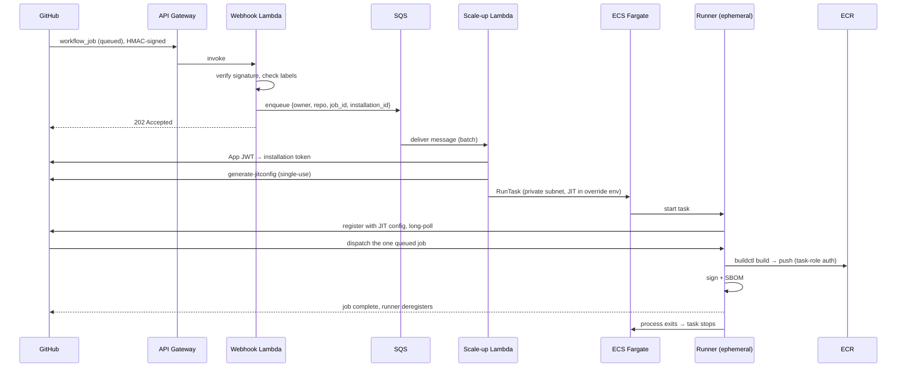
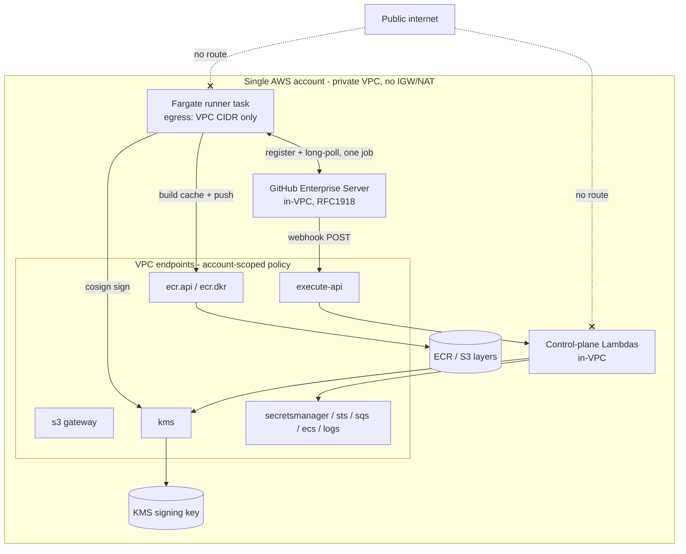
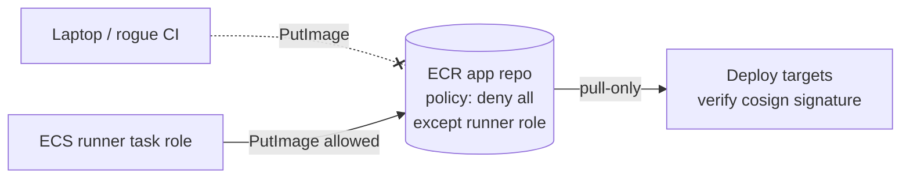
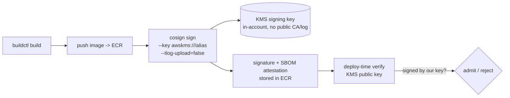

# Solution Design — Managed GitHub Actions Runners on AWS ECS (Private Builds → ECR)

**Status:** Reference design · **Audience:** Platform / DevSecOps engineers · **Scope:** Self-hosted GitHub Actions build plane on Amazon ECS Fargate, enforcing that all container artifacts are built on private infrastructure and stored in Amazon ECR.

---

## 1. Objective & requirements

The goal is to take CI builds off GitHub-hosted runners and run them on **private, account-owned compute** so that source, build environment, and produced artifacts never leave a controlled boundary, and so that the only path for an image to reach the deployment registry is "built by our runner."

**Functional requirements**

- Run GitHub Actions jobs on ECS-based self-hosted runners.
- Build container images and push them to Amazon ECR.
- Provision capacity on demand and reclaim it automatically after each job.

**Non-functional requirements**

- *Enforcement* — it must be infeasible to land an artifact in the deployment ECR repo without going through the runner.
- *No public exposure* — every hop (ingress, control plane, build, registry, signing, verification) stays inside one AWS account over PrivateLink/private subnets; nothing traverses the public internet and nothing depends on a public SaaS.
- *Signed artifacts* — every image is cryptographically signed in-account; only signed, runner-produced images are deployable.
- *Isolation* — one job must not be able to observe or tamper with another; no credential or filesystem reuse across jobs.
- *Least privilege* — every identity (runner, control plane, registry) holds only the permissions it needs.
- *No long-lived secrets* — no PATs, no static registry credentials, no reusable runner registration tokens.
- *Observability & cost control* — every job is traceable; parallelism and spend are bounded.

The requirements that drive most of the architecture are **ephemerality** (clean, single-use runners), **enforcement** (ECR as a gate, not just a bucket), and **no public exposure** (every dependency replaced by a private equivalent).

### 1.1 "No public" — what it means here and the one honest caveat
"No public" is interpreted strictly: runners and the control plane sit in private subnets with **egress restricted to the VPC CIDR**, all AWS services are reached over **VPC endpoints scoped to this account**, the webhook ingress is a **private REST API** reachable only via the `execute-api` endpoint, image **signing uses an in-account KMS key with the public transparency log disabled**, and base images are pulled through a **private ECR pull-through cache**.

The single unavoidable caveat: GitHub.com (SaaS) lives on the public internet, so if you use GitHub.com cloud, the webhook *source* and the runner's long-poll *target* are public. A genuinely no-public deployment therefore uses **GitHub Enterprise Server (GHES) deployed inside the VPC** (or GitHub Enterprise Cloud with PrivateLink), so even GitHub is private RFC1918. The design below assumes GHES-in-VPC; §5.1 documents exactly what degrades if you must use GitHub.com cloud.

---

## 2. Why ECS Fargate, and the one constraint that shapes everything

Fargate gives us "managed" runners in the truest sense: there is no EC2 host to patch, no Docker daemon to secure, no cluster autoscaler to tune. AWS owns the substrate; we own a container image and an IAM role.

The constraint that follows from that choice: **Fargate does not allow `--privileged` and gives you no Docker daemon.** You therefore cannot do classic Docker-in-Docker image builds. The design resolves this with a **daemonless, rootless builder** — rootless BuildKit in the reference implementation, with kaniko as a documented alternative. Both build an OCI image and push it straight to ECR without ever talking to a Docker socket.

If a team genuinely needs full Docker compatibility (e.g. `docker compose` integration tests, privileged builds), the same control plane drives an **ECS-on-EC2** capacity provider instead; that variant is covered in §11. Everything else in this design is identical between the two.

---

## 3. High-level architecture

**Control plane** (everything from API Gateway to the scale-up Lambda) decides *when* and *how many* runners to start. **Data plane** (the Fargate task) does the actual build. They are decoupled by SQS so that bursts, GitHub redeliveries, and transient AWS errors are absorbed and retried rather than dropped.

The lifecycle of a single build:

There is no scale-down controller. A runner is one task that takes exactly one job and exits; scale-in is a side effect of ephemerality.

---

## 4. Component deep-dive

### 4.1 GitHub App + webhook (identity into GitHub)
Authentication into GitHub uses a **GitHub App**, not a PAT. The app holds `Actions: read/write` and `Administration` (self-hosted runners) permissions on the installed repos/org. Two reasons: app installation tokens are short-lived (1 hour) and automatically scoped to the installation, and the app's webhook delivers `workflow_job` events that drive scaling. The app's private key lives in Secrets Manager and is the only durable credential in the system.

### 4.2 Webhook Lambda (front door)
A deliberately tiny, internet-facing function. It (1) verifies the `X-Hub-Signature-256` HMAC against the webhook secret in constant time, (2) ignores anything that isn't `workflow_job`/`queued`, (3) confirms the job's labels are a superset of our required labels so we never provision capacity for GitHub-hosted jobs, and (4) enqueues a compact message to SQS and returns `202`. It makes **no** GitHub API calls and needs **no** outbound internet — keeping the public attack surface minimal. Source: `lambda/webhook/handler.py`.

### 4.3 SQS + DLQ (the buffer)
The queue decouples ingestion from provisioning. It absorbs CI bursts, smooths over GitHub's at-least-once webhook delivery (the runner being ephemeral makes an accidental extra runner harmless — it just times out idle), and provides retry semantics. After `maxReceiveCount` failures a message lands in the DLQ, which is alarmed: a non-empty DLQ means a job never got a runner.

### 4.4 Scale-up Lambda (the provisioner)
SQS-triggered, with **reserved concurrency** that acts as a hard ceiling on simultaneous runner launches (cost + blast-radius guardrail). For each message it mints an App JWT → installation token → **single-use JIT runner config**, then calls `ecs:RunTask` on Fargate in private subnets with `assignPublicIp=DISABLED`. The JIT config is passed as a per-task container *override* env var — never baked into the image or task definition — so it exists only for the life of one task. Partial-batch failure reporting ensures one bad message is retried/parked without re-running its successful batch-mates. Source: `lambda/scale_up/handler.py`.

### 4.5 ECS Fargate runner (the build)
The runner image (`runner/Dockerfile`) bundles the GitHub Actions runner, AWS CLI, the Amazon ECR credential helper, rootless BuildKit, and supply-chain tooling (syft, cosign). The entrypoint configures the ECR credential helper for the task's account/region, starts `buildkitd` rootless (no daemon, no privileged), then runs `./run.sh --jitconfig …`. The runner picks up its single job, the workflow drives `buildctl … --output type=image,push=true`, and on completion the process exits, stopping the task. ECR authentication is implicit via the **task role** through the credential helper, so there are no registry credentials anywhere in the pipeline.

### 4.6 ECR (the gated artifact store)
Repositories are **tag-immutable**, **KMS-encrypted**, **scanned on push** plus continuous **enhanced (Inspector) scanning**, and governed by a **repository policy that only permits the runner task role to push** with an explicit deny for every other principal. This is the lynchpin of enforcement (§6).

---

## 5. Networking — everything private, scoped to one account

Runners **and** the control-plane Lambdas run in **private subnets with no IGW/NAT route**. Their security groups permit **no inbound** and **egress only to the VPC CIDR** — so they can reach the VPC endpoints and the in-VPC GitHub Enterprise Server, and literally nothing on the internet. Every AWS service is consumed over an **Interface or Gateway VPC endpoint** (PrivateLink), and each endpoint carries a **policy that pins usage to this account** (`aws:PrincipalAccount`). The webhook ingress is a **private REST API** that resolves only through the `execute-api` endpoint, with a resource policy that denies any call not arriving via that endpoint.

Every interface endpoint (ecr.api, ecr.dkr, logs, secretsmanager, sts, ssm, **kms**, **sqs**, ecs, ecs-agent, ecs-telemetry, **execute-api**) plus the S3 gateway endpoint is account-scoped. The KMS endpoint is what lets in-account signing happen privately; the SQS endpoint is what lets the in-VPC Lambdas talk to the queue without leaving the VPC.

### 5.1 GitHub ingress/egress without the public internet
The event source is **GitHub Enterprise Server running inside the VPC**. GHES posts `workflow_job` webhooks to the **private** REST API over PrivateLink, and runners register + long-poll GHES over RFC1918 — so neither ingress nor egress touches the internet. Actions are served from GHES (bundled/mirrored), so there is no `github.com` action download either.

**If you must use GitHub.com cloud** instead of GHES: GitHub's webhook delivery and the runner's job long-poll are then over the public internet (GitHub's egress), which you cannot make private. The least-bad mitigation is a public ingress (regional API Gateway or ALB) locked to GitHub's published hook IP ranges via WAF, plus a controlled egress proxy allowlisting only GitHub endpoints. This is explicitly *not* "no public," which is why GHES-in-VPC is the design's default.

### 5.2 Private dependency map
Each external dependency a naïve design would reach over the internet has a private replacement here:

| Would-be public dependency | Private replacement in this design |
|---|---|
| GitHub.com webhook + runner long-poll | GitHub Enterprise Server **in-VPC** (RFC1918) |
| Public API Gateway / HTTP API | **Private REST API** behind the `execute-api` endpoint |
| ECR / S3 / Secrets / STS / KMS / SQS / ECS over internet | **VPC endpoints**, account-scoped policies |
| Docker Hub / public.ecr.aws base images | **ECR pull-through cache** (private) |
| cosign keyless → Sigstore Fulcio/Rekor (public) | **cosign + in-account KMS key**, transparency log disabled |
| Lambda egress to internet | Lambdas **in-VPC**, egress to VPC CIDR only |
| NAT gateway to the internet | **none** — removed entirely |

---

## 6. Enforcing "private builds only"

"Enforcement" is the requirement most designs hand-wave. It works here as **defence in depth** across three layers; the third is the one that actually makes it stick.

**Layer 1 — Source/workflow governance (GitHub).** Restrict who can change CI: `CODEOWNERS` on `.github/workflows/**` with required review; org **allowed-actions** policy plus a **pinned-SHA ruleset** so only vetted, SHA-pinned actions run; branch protection / rulesets that **require the build-and-push check** to pass before merge; and runner-group scoping so only approved repos can use the ECS runner group. This makes "build somewhere else" hard to introduce.

**Layer 2 — Capacity gating.** Jobs only get a runner if they request the exact `self-hosted, ecs, …` labels, and the runner group is restricted to specific repositories. A job that doesn't target our labels simply never receives capacity (fail-closed) rather than silently falling back to a GitHub-hosted runner — which you additionally disable at the org level.

**Layer 3 — Registry gate (the real control).** The ECR repository policy grants `PutImage`/layer-upload **only to the runner task role**, with an explicit `Deny` for all other principals. Deployment targets (EKS/ECS/Lambda) are configured to pull **only** from this registry. The net effect: even if someone managed to build an image on a laptop or a rogue pipeline, **they cannot land it in the registry the platform deploys from.** Combined with image signing (§7.5) and a deploy-time signature check, the deployable set is exactly "images built and signed by the runner."

---

## 7. Security design

### 7.1 Identity & access
- **GitHub App** instead of PAT; private key in Secrets Manager (KMS-encrypted), rotated; the only durable credential.
- **JIT runner registration** — single-use config, auto-deregisters; no reusable registration token to steal.
- **Three distinct IAM roles**: task *execution* role (image pull + logs, used by the ECS agent), runner *task* role (job-time permissions: ECR push to named repos only), and per-Lambda roles. `iam:PassRole` on the scale-up Lambda is constrained with `iam:PassedToService = ecs-tasks.amazonaws.com`.
- **ECR auth via task role** through the credential helper — no static registry credentials; tokens are 12-hour, role-derived, and never written to the image.
- **Optional OIDC** for any cross-account or third-party access from inside the job, avoiding stored cloud keys entirely.

### 7.2 Network security
Private subnets, no public IP, inbound-deny security groups, **egress restricted to the VPC CIDR** (no internet), all AWS traffic over account-scoped VPC endpoints, private REST API ingress, and GitHub Enterprise Server in-VPC. No NAT gateway exists.

### 7.3 Runner isolation & ephemerality
One task = one job. No runner is reused, so there is no cross-job filesystem, env, or credential leakage and no persistent runner to compromise. Fargate gives each task its own kernel-isolated microVM (Firecracker). `enableExecuteCommand=false` blocks ECS Exec into build runners. The build engine is **rootless**, so a compromised build step has no root and no host.

### 7.4 Secrets management
GitHub App key and webhook secret live in Secrets Manager, KMS-encrypted, fetched at runtime and cached in-process by the Lambdas (never in env vars or images). JIT config is injected per-task as a short-lived override and is single-use. Rotate the App key and webhook secret on a schedule.

### 7.5 Supply-chain security & in-account image signing
Signing is a first-class control here, and it is done **entirely inside the account with no public dependency**:

- **Signing key** — an asymmetric **AWS KMS CMK** (`ECC_NIST_P256`, `SIGN_VERIFY`). The private key never leaves KMS; the runner task role is granted only `kms:Sign` + `kms:GetPublicKey`.
- **Signer** — `cosign sign --key awskms:///alias/…-signing --tlog-upload=false`. Using a KMS key means signing is **not** keyless, so there is **no call to public Sigstore Fulcio (CA) or Rekor (transparency log)**; `--tlog-upload=false` ensures no transparency-log write either. The only services touched are **KMS and ECR**, both over PrivateLink. The KMS URI is injected into the runner task as `SIGNING_KMS_URI`.
- **Signature & attestation storage** — cosign stores the signature and the SBOM attestation as **OCI artifacts in ECR** alongside the image (no external store).
- **In-pipeline verification** — the build verifies its own signature (`cosign verify --key … --insecure-ignore-tlog=true`) before treating the artifact as releasable, so a signing misconfiguration fails the build rather than shipping unsigned.
- **Deploy-time verification** — deploy targets verify the same signature with the KMS key's **public** key (which can be distributed freely or read via `kms:GetPublicKey`) before admitting an image — e.g. a Kubernetes admission controller / sigstore-policy-controller configured with the KMS public key, or an ECS deploy gate. Combined with the ECR push restriction (§6), the deployable set is exactly "images **built by the runner and signed by the in-account key**."
- **SBOM** — generated with syft and attached as a KMS-signed attestation.
- **Image scanning** — scan-on-push + continuous Inspector enhanced scanning; alarm/break-glass on critical CVEs.
- **Pinned actions** (full SHAs) + allowed-actions policy; runner base image + runner version pinned and rebuilt on a schedule, scanned in ECR.

An alternative fully-managed path is **AWS Signer + Notation** (signing profile in-account, Notation trust policy at verify time); it has the same "no public" property. cosign+KMS is the default here because every dependency it has (KMS, ECR) provably has a VPC endpoint.

### 7.6 Image signing alternative — AWS Signer
Where a team prefers a managed signing service over cosign, AWS Signer issues signatures via an in-account **signing profile**, ECR stores them as referrers, and **Notation** verifies them against a trust policy at deploy time. Same in-account, no-public guarantee; choose based on tooling preference and whether the verify side standardizes on Notation or cosign.

### 7.7 Data protection
Customer-managed KMS key (rotation on) encrypts ECR images, Secrets Manager secrets, CloudWatch log groups, and SQS. Fargate ephemeral storage is encrypted; it is also discarded with the task.

### 7.8 The public-repo / fork-PR trap
**Never run self-hosted runners on public repositories with `pull_request` from forks.** A fork PR can modify the workflow and execute arbitrary code on your private build infrastructure with your task role. Mitigations: keep this plane on private repos; for public repos require an explicit maintainer approval/label gate (`pull_request_target` used carefully) before any self-hosted job runs; and rely on the fact that each runner is ephemeral and least-privileged to bound the blast radius even if abused. This is called out in the sample workflow.

### 7.9 Threat model (abbreviated)

| Threat | Control |
|---|---|
| Stolen runner registration token | JIT single-use config; auto-deregister |
| Forged webhook triggering runners | HMAC-SHA256 signature verification; label gate; concurrency cap |
| Cross-job credential/data leakage | Ephemeral single-use tasks; microVM isolation; rootless build |
| Pushing an unvetted image to prod | ECR repo policy (runner-role-only push) + deploy-time signature verify |
| Deploying an unsigned / tampered image | In-account KMS signing + deploy-time `cosign verify` against the KMS public key |
| Signing infra leaking to / depending on public SaaS | KMS-backed signing, transparency log disabled — no Fulcio/Rekor calls |
| Compromised action / dependency | SHA-pinned actions; allowed-actions policy; SBOM + scanning |
| Exfiltration over the network | Private subnets; egress capped to VPC CIDR; account-scoped endpoints; no NAT |
| Cross-account use of our endpoints | Endpoint policies pinned to `aws:PrincipalAccount` |
| Long-lived cloud credentials in a build | Task-role-based ECR auth; OIDC for third parties; no static keys |
| Runaway cost / fork-PR abuse | Reserved Lambda concurrency cap; label gate; private-repo policy |

---

## 8. Operations

### 8.1 Autoscaling & capacity
Scale-out is event-driven: one queued job → one SQS message → one `RunTask`. Scale-in is implicit (tasks exit). The **reserved concurrency** on the scale-up Lambda is the hard ceiling on parallel launches; raise it deliberately with cost in mind. Fargate task start latency is tens of seconds; if cold-start is unacceptable for a team, a small **warm pool** of pre-registered non-ephemeral runners can front the queue, trading a little isolation purity for latency. **Fargate Spot** (with a Fargate base for the on-demand floor) cuts cost ~70% for interruption-tolerant builds; surface interruptions as retried jobs.

### 8.2 Observability
- **Logs**: runner logs to a KMS-encrypted CloudWatch group via `awslogs`; Lambda and API Gateway access logs likewise. Ship to a SIEM as needed.
- **Metrics**: Container Insights for running-task count; SQS depth and *age of oldest message* as the key "are builds waiting?" signal; Lambda errors/throttles.
- **Alarms** (→ SNS): DLQ not empty, oldest-message age high, scale-up errors, scale-up throttled. A dashboard ties queue depth to running tasks.
- **Audit**: CloudTrail for `RunTask`/IAM/Secrets access; GitHub audit log for workflow and runner changes; tags propagate `owner/repo/job_id` onto each task for traceability and cost allocation.

### 8.3 Cost management
Spend ≈ (concurrent tasks × task size × build minutes) + ECR storage + VPC interface-endpoint hours. Levers: right-size `runner_cpu/memory`, Fargate Spot, the concurrency cap, ECR lifecycle policies (expire untagged + cap image count), and per-task tags feeding Cost Explorer / budgets. There is no NAT data-processing charge because there is no NAT — all AWS traffic rides the endpoints; the trade is a flat per-AZ hourly cost per interface endpoint.

### 8.4 Reliability & DR
Multi-AZ private subnets; SQS + DLQ for durability and retry; idempotent provisioning (a duplicate webhook yields at most one harmless extra idle-timeout runner). Handle GitHub API rate limits with backoff and per-installation token caching. All infra is in version-controlled Terraform with remote, locked, encrypted state — rebuildable in another region/account.

### 8.5 Maintenance & patching
No EC2 to patch on Fargate. The runner image is the maintenance surface: pin and bump the runner version and base image on a schedule (Dependabot/cron rebuild), scan in ECR, and roll forward by pushing a new `:latest` (the next task picks it up). GitHub deprecates old runner versions, so automate the bump.

### 8.6 Quotas & limits to watch
`RunTask` API rate, Fargate concurrent-task and Spot quotas, ECS task-launch throttling, ECR push throughput, Lambda concurrency, and GitHub API rate limits. The SQS buffer + scale-up batching + reserved concurrency keep launches under these ceilings; request quota increases before scaling CI volume up.

---

## 9. Failure modes & runbook (selected)

| Symptom | Likely cause | Action |
|---|---|---|
| DLQ alarm fires | Scale-up failing (GitHub auth, RunTask error, quota) | Inspect scale-up logs; check App key validity, Fargate quota, subnet capacity; redrive DLQ after fix |
| Jobs queue, age alarm high | Concurrency cap hit, or Fargate capacity/quota | Raise `max_concurrent_runners` (cost-aware) or Fargate quota; consider Spot+base |
| Runner starts then job fails to register | JIT config expired / clock skew / wrong runner group | Verify App permissions + `runner_group_id`; check Lambda clock and token caching |
| Push to ECR denied | Task role not matching repo policy, or wrong repo | Confirm `runner_task` role ARN in repo policy and task-role ARN scoping |
| Webhook 401s in API GW logs | Wrong/rotated webhook secret | Re-sync secret in GitHub App and Secrets Manager |

---

## 10. Deployment outline
1. Stand up **GitHub Enterprise Server in the VPC** (or GitHub Enterprise Cloud + PrivateLink). Create the GitHub App (permissions: Actions r/w, Administration r/w, webhook `workflow_job`), install it, note App ID + Installation ID, generate a private key.
2. `terraform apply` the module (existing VPC, private subnets, and **VPC CIDR** as inputs; set `github_api_url` to the GHES API).
3. Put the App PEM into the created Secrets Manager secret (out-of-band, never in state).
4. Build & push the runner image to the runner ECR repo, sourcing the base image and tool binaries from private mirrors / the pull-through cache.
5. Set the App's webhook URL to the **private** `webhook_url` output (it resolves only inside the VPC via the `execute-api` endpoint) and the webhook secret to the generated value.
6. Add `build-and-push.yml` to a repo; open a PR; watch a Fargate task spin up, build, push a **KMS-signed, SBOM-attested** image to ECR, verify its own signature, and disappear. Wire deploy-time `cosign verify` against the signing key's public key.

Full commands are in `README.md`.

---

## 11. Variant: ECS on EC2 (full Docker)
Swap the Fargate capacity provider for an **EC2 Auto Scaling capacity provider** with managed scaling. The same control plane and JIT flow apply; the runner image can then use the host Docker daemon (or a sidecar) for privileged/DinD builds. Trade-offs: you now own AMI patching, host hardening, and scale-in protection, and you lose per-task microVM isolation (mitigate with one task per instance or strong container isolation). Choose this only when a daemonless builder genuinely can't meet the workload.

## 12. Roadmap
- Warm-pool option for latency-sensitive teams.
- Per-team runner groups + per-team ECR repos with scoped task roles.
- AWS Signer + admission-controller verification on the deploy side.
- Cost anomaly detection on the build plane; automatic quota-aware concurrency tuning.
- GitHub Enterprise Server support (private webhook ingress via PrivateLink).
